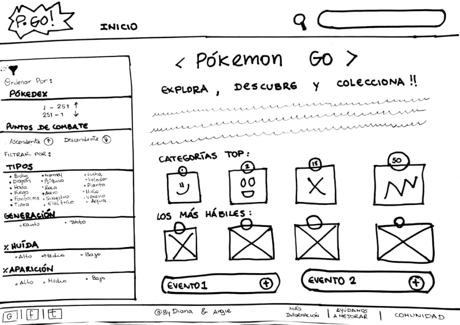

## NUEVA POKÉDEX

Para nuestro proyecto de nueva pokédex hemos considerado trabajar con dos tipos de usuarios:
- Primero nos enfocamos principalmente en jugadores principiantes de Pokémon GO que buscan coleccionar el mayor numero de pokémons en el juego,
- y luego nos enfocamos en jugadores experimentados que tienen como objetivo combatir con otros entrenadores y ganar gimnasios.

Una vez definidos los usuarios con los que ibamos a trabajar desglozamos una a una sus necesidades en un total 9 historias de usuario.

Nuestro primer prototipo de baja fidelidad fue diseñado de la siguiente manera:

