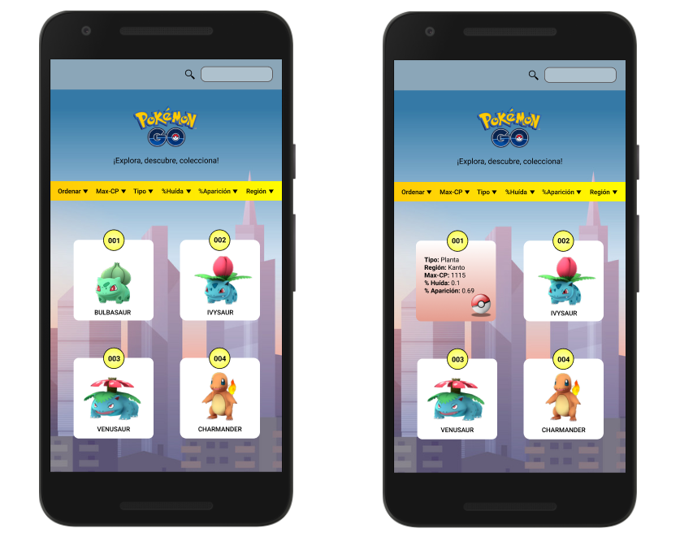

## NUEVA POKÉDEX

Para nuestro proyecto de nueva pokédex hemos considerado trabajar con dos tipos de usuarios:
- Primero nos enfocamos principalmente en jugadores principiantes de Pokémon GO que buscan coleccionar el mayor numero de pokémons en el juego,
- y luego nos enfocamos en jugadores experimentados que tienen como objetivo combatir con otros entrenadores y ganar gimnasios.

Una vez definidos los usuarios con los que ibamos a trabajar desglozamos una a una sus necesidades en un total 9 historias de usuario.

Nuestro primer prototipo de baja fidelidad fue diseñado de la siguiente manera:

En un inicio nuestra idea era mostrarle al usuario una pantalla principal en la que se le mostrara una serie de tarjetas con iconos que hicieran referencia a las categorías mas top para los jugadores, y los filtros y pociones para ordenar se iban a mostrar en un desplegable con un ícono de embudo.
Testeamos éste primer prototipo con al menos 2 usuarios y notamos que se quedaron un poco trabados al momento de querer ordenar o filtrar a los pokémon es así que tuvimos que replantearnos la pantalla que se iba a mostrar al momento de ingresar a la web y creamos nuestro segundo prototipo de baja fidelidad.

Enfocándonos un poco más en nuestra 1era historia de usuario cambiamos la vista de la pantalla inicial de la web, mostrando todos los pokémons ordenados por su número de pokédex.
Luego empezamos a trabajar en los prototipos de alta de las demás historias de usuario, quedando así:

lo testeamos nuevamente con 1 usuario y nos hizo ver que la barra donde mostrábamos los filtros estaba muy ajustada y no era muy comodo a la vista ni mucho menos al intentar acceder a alguna opción con el dedo, ya que podía escoger otra por error. Así que rediseñamos el área de los filtros:

 De barra con desplegables cambiamos a "botones", testeamos nuevamente con al menos 2 usuarios éste prototipo y resultó ser más intutitivo que el anterior, y luego pasamos a diseñarlo en versión Desktop.

